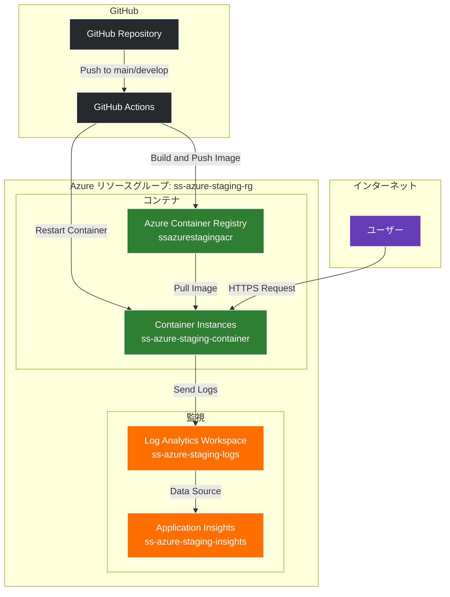
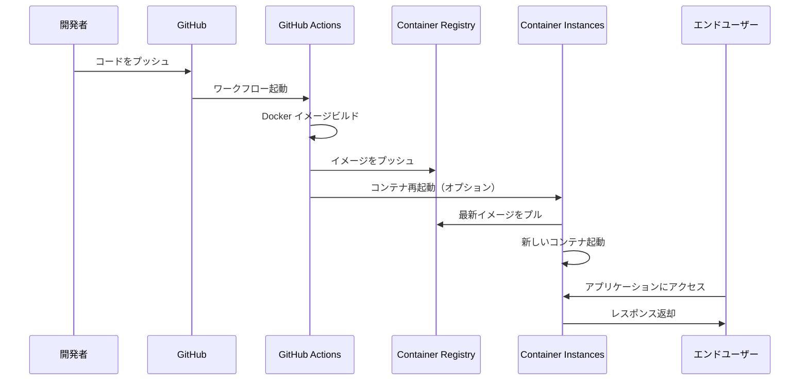
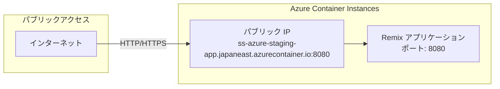
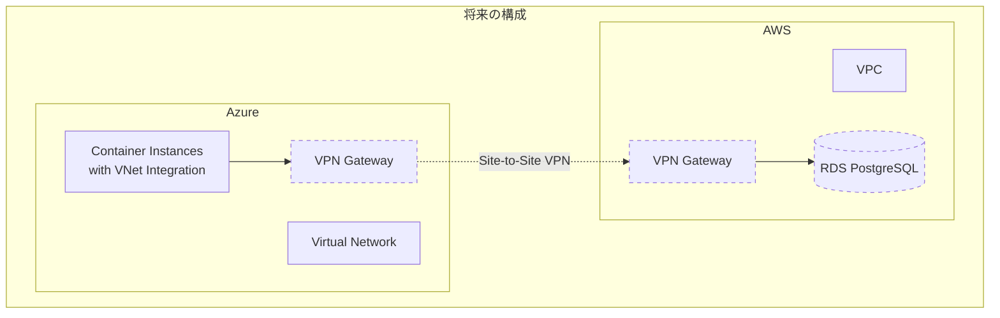

# Azure インフラストラクチャ構成図

## 現在の構成



## リソース詳細

### 1. Azure Container Registry (ACR)
- **名前**: ssazurestagingacr
- **SKU**: Basic
- **用途**: Docker イメージの保存
- **認証**: Admin ユーザー有効

### 2. Container Instances
- **名前**: ss-azure-staging-container
- **イメージ**: ssazurestagingacr.azurecr.io/ss-azure-app:latest
- **リソース**: 
  - CPU: 1.0 コア
  - メモリ: 1.5 GB
- **ポート**: 8080 (TCP)
- **DNS**: ss-azure-staging-app.japaneast.azurecontainer.io
- **ヘルスチェック**:
  - Liveness Probe: `/api/liveness`
  - Readiness Probe: `/api/ready`

### 3. Log Analytics Workspace
- **名前**: ss-azure-staging-logs
- **保持期間**: 30日
- **SKU**: PerGB2018

### 4. Application Insights
- **名前**: ss-azure-staging-insights
- **タイプ**: Web アプリケーション
- **接続**: Log Analytics Workspace と統合

## デプロイフロー



## ネットワーク構成



## 環境変数

Container Instances に設定されている環境変数：

| 変数名 | 値 | 説明 |
|--------|-----|------|
| NODE_ENV | production | Node.js 実行環境 |
| PORT | 8080 | アプリケーションポート |
| APPLICATIONINSIGHTS_CONNECTION_STRING | (secure) | Application Insights 接続文字列 |

## セキュリティ設定

1. **Container Registry**
   - Admin ユーザー認証
   - GitHub Actions からのアクセスのみ許可（サービスプリンシパル経由）

2. **Container Instances**
   - パブリック IP アドレス（現在）
   - 将来的に VNet 統合予定

3. **GitHub Actions**
   - Azure サービスプリンシパルによる認証
   - シークレット管理による認証情報の保護

## 今後の拡張計画



## リソース管理

すべてのリソースは Pulumi で管理されており、以下のコマンドで操作可能：

```bash
# リソースの作成/更新
pulumi up

# リソースの削除
pulumi destroy

# 現在の状態確認
pulumi stack
```